# CSCI432 Final Project – RONR Meeting Platform

## 🌐 Website URL

**https://ronrcommittee.netlify.app/**

> ⚠️ **IMPORTANT:** The backend server is hosted on a free tier and goes to sleep after periods of inactivity. **If the site seems unresponsive, please wait up to 1 minute** for the server to wake up. After that initial delay, everything will work normally!

---

## 🎥 Video Demo

**[Watch the Demo on YouTube](DUMMYLINK)**

A walkthrough of the RONR Meeting Platform showcasing the chairman and member views, motion workflow, and real-time voting features.

---

## Project Description

The RONR Meeting Platform is a web-based application designed to facilitate formal committee meetings following Robert's Rules of Order. Inspired by Kahoot's interactive presentation model, our platform creates a dual-view experience where the **chairman displays their screen on a projector** for the entire committee to see, while **members participate from their own devices** with streamlined, limited controls.

### How It Works

**Chairman View (Displayed on Projector):**
- Full control over the meeting flow
- Manages the agenda and navigates between items
- Reviews and approves/denies proposed motions
- Initiates voting on motions
- Displays real-time voting results and motion outcomes for all to see
- Shows the meeting code for members to join

**Member View (Individual Devices):**
- Simplified interface focused on participation
- Join meetings using a 6-character code
- Propose new motions for chairman review
- Vote on active motions (Aye/No)
- Raise hand to get chairman's attention
- View current motion and voting status

### Key Features

- **Real-time Synchronization:** All participants see updates instantly as the chairman navigates the meeting
- **Motion Workflow:** Motions flow through a clear lifecycle (pending → proposed → voting → approved/failed)
- **30-Second Voting Windows:** Timed voting periods ensure efficient decision-making
- **Join Codes:** Easy 6-character codes let members quickly join meetings
- **Meeting Minutes:** Automatic generation of meeting records with all motion outcomes

### Technology Stack

- **Frontend:** React + Vite
- **Backend:** Node.js + Express
- **Database:** MongoDB Atlas
- **Authentication:** JWT
- **Hosting:** Netlify (frontend) + Render (backend)

---

## 📸 Features Walkthrough

A complete visual tour of every feature in the RONR Meeting Platform.

---

### 1. Sign Up Page

New users can create an account by providing their full name, email address, and password.

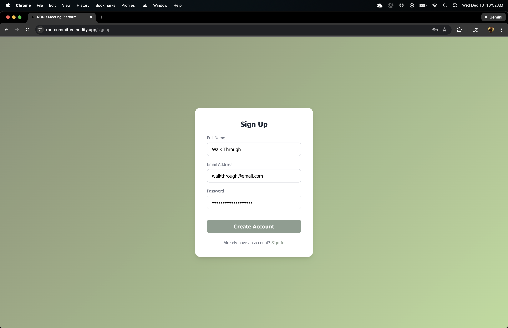

**Features:**
- Full name, email, and password input fields
- Form validation ensures all fields are filled
- Link to login page for existing users
- Success message redirects to login after account creation

---

### 2. Login Page

Existing users authenticate with their email and password to access their account.

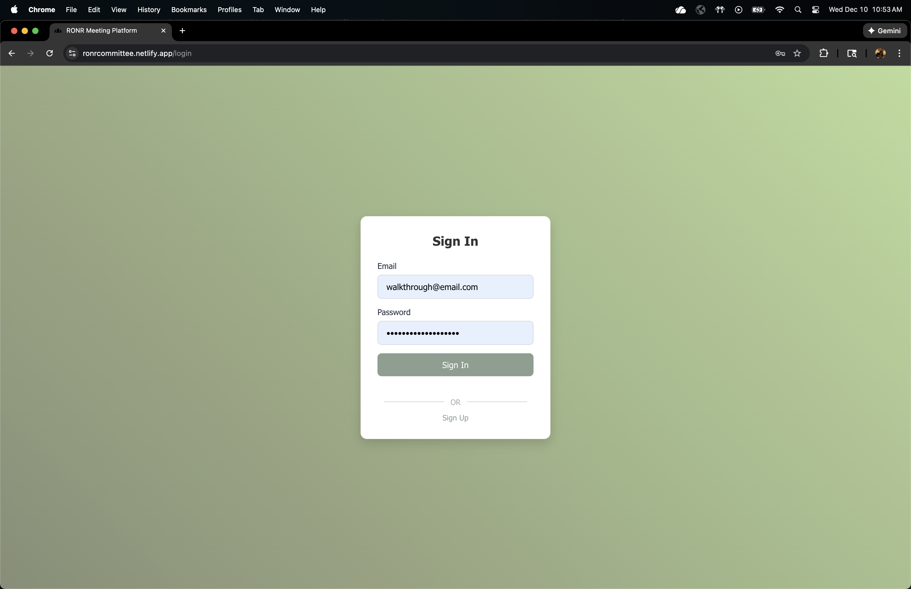

**Features:**
- Email and password authentication
- "Remember me" convenience
- Link to sign up page for new users
- JWT token stored for session management

---

### 3. Home Page

The central hub where users manage their meetings and join others' meetings. Through the task bar users can access the profile page or sign out.

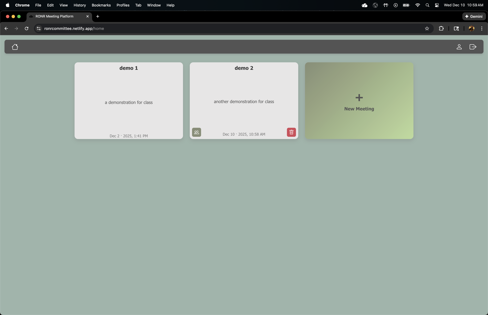

#### Creating a New Meeting

Click the "New Meeting" button to open a modal where you can create a meeting or join an existing one.

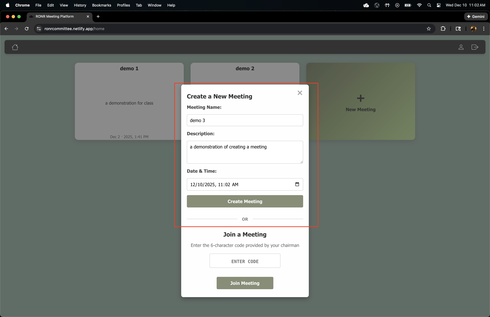

**Create Meeting Features:**
- Meeting name (max 30 characters)
- Description field (max 150 characters)
- Date and time picker
- Creates a unique 6-character join code

#### Joining a Meeting

In the same modal, enter a 6-character code to join a meeting as a participant.

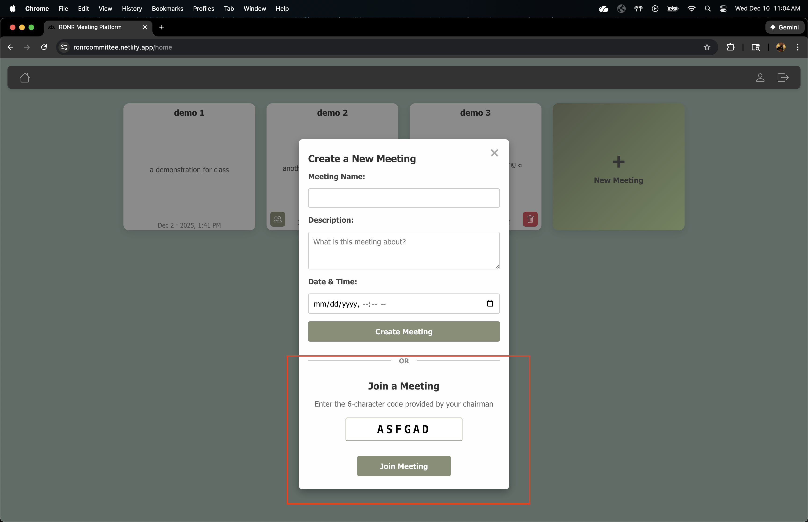

**Join Meeting Features:**
- 6-character code input (auto-capitalizes)
- Validation feedback for invalid codes
- Instantly adds meeting to your dashboard

#### Meeting Cards

Each meeting you've created or joined appears as a card on your dashboard.

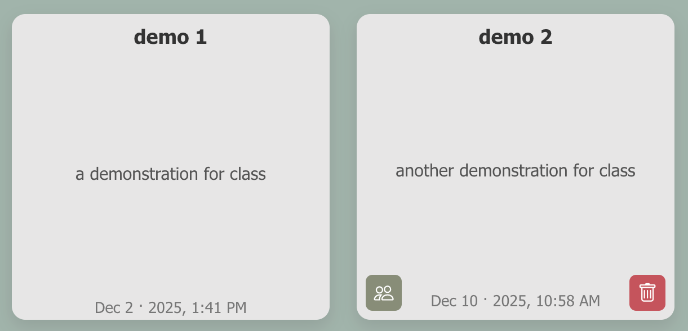

**Card Features:**
- Meeting name and description
- Date and time display
- Chairmen can edit participants or delete the meeting
- Click to enter the meeting

#### Managing Participants

As a chairman you can click the people icon on a meeting card to manage who can access your meeting.

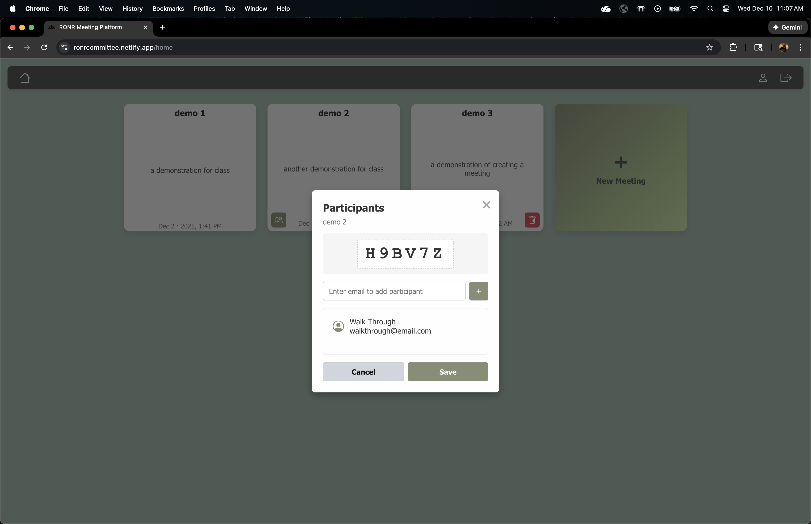

**Participant Management Features:**
- View all current participants with names and emails
- Add participants by email address
- Remove participants (except yourself as chairman)
- Display the meeting's join code for sharing
- Save/Cancel buttons with unsaved changes warning

#### Deleting a Meeting

Click the trash icon to delete a meeting you've created.

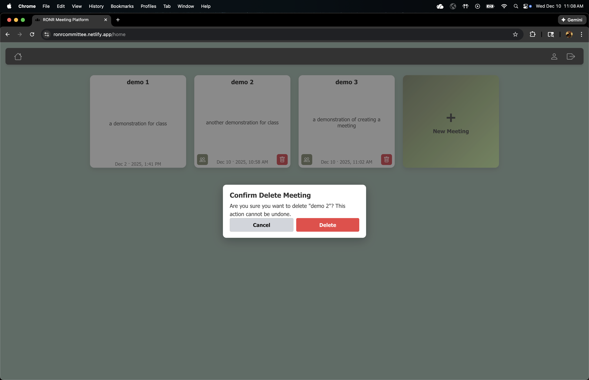

**Delete Features:**
- Confirmation dialog prevents accidental deletion
- Only the meeting chairman can delete meetings
- Permanently removes meeting and all associated data

---

### 4. Profile Page

Users can view and edit their personal information. This can be accessed through the task bar.

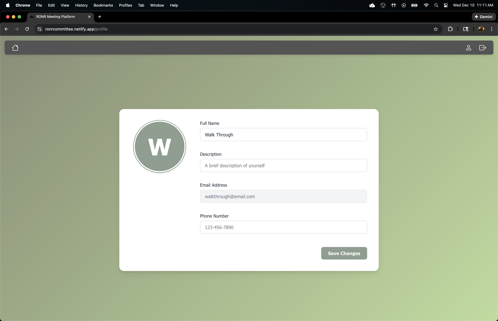

**Features:**
- Profile avatar with first initial
- Editable full name
- Editable bio/description
- Phone number field
- Email display (read-only)
- Save changes button with confirmation

---

### 5. Meeting Page

The meeting page has two distinct views based on the user's role: **Chairman View** (for the meeting creator) and **Member View** (for participants).

---

#### Chairman View

The chairman has full control over the meeting displayed on a projector for all to see.

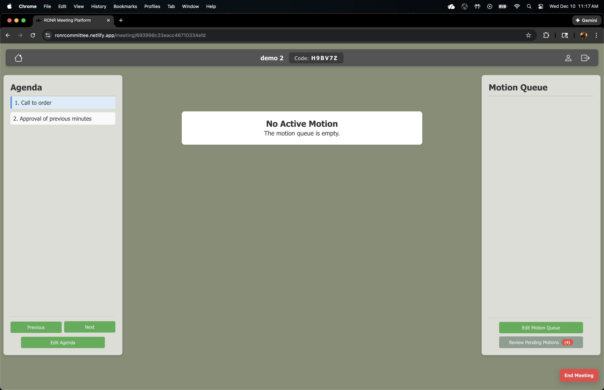

##### Taskbar

The top navigation bar provides quick access to key information.

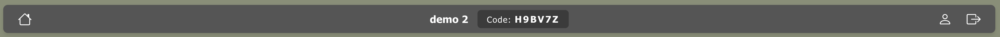

**Taskbar Features:**
- Meeting name display
- Join code display (for sharing with members)
- Profile and logout options
- Home navigation

##### Agenda Sidebar (Left)

Manage and navigate through the meeting's agenda items.

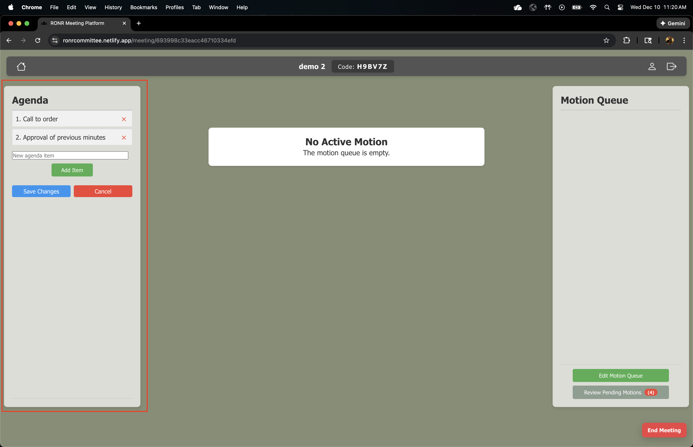

**Agenda Features:**
- List of all agenda items
- Current item highlighted
- Previous/Next navigation buttons
- Edit mode to add, reorder, or remove items
- Drag-and-drop reordering
- Save/Cancel editing changes

##### Motion Queue Sidebar (Right)

View and manage all motions in the meeting.

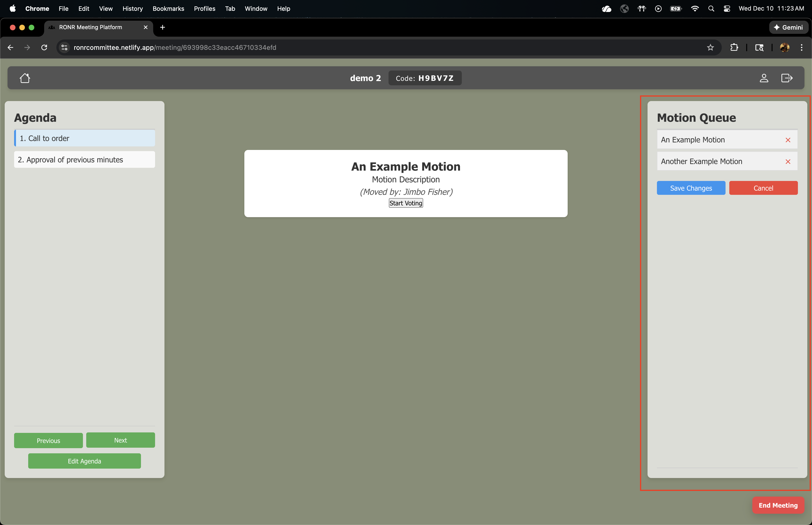

**Motion Queue Features:**
- List of all non-pending motions
- Status badges (proposed, approved, failed, etc.)
- Previous/Next navigation buttons
- Edit mode to reorder or remove motions
- Drag-and-drop reordering
- Button to review pending motions

##### Center Content Area

The main display area shows the current motion and voting controls.

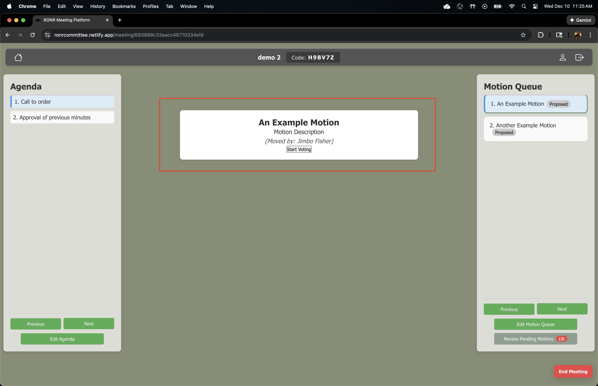

**Center Content Features:**
- Large motion title and description display
- Motion creator attribution
- Status badge for completed motions
- "Start Vote" button to initiate voting

##### Pending Motions Review

When members propose motions, the chairman reviews them before they enter the queue.

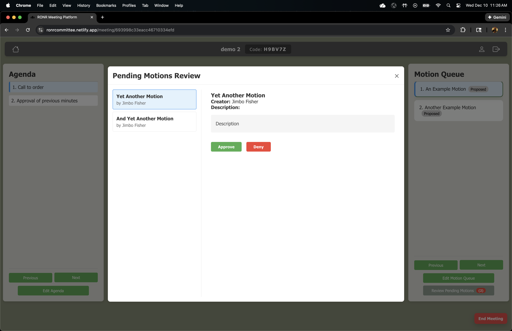

**Review Features:**
- List of all pending motions
- Motion details with proposer name
- Approve button (adds to motion queue)
- Deny button (rejects the motion)
- Motion count indicator

##### Starting a Vote

The chairman initiates a 30-second voting period for a motion.

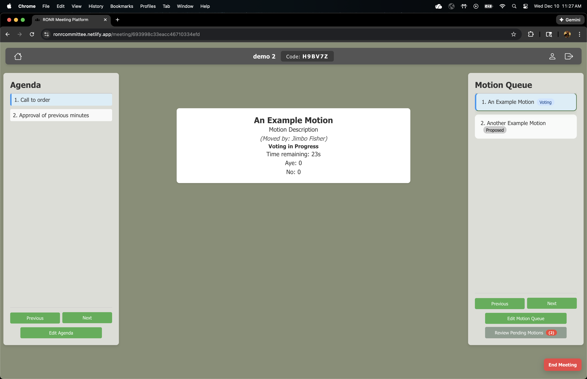

**Voting Features:**
- 30-second countdown timer
- Real-time vote count (Aye vs No)
- All participants see the timer synchronized
- Voting auto-completes when timer expires

##### Voting Results

After voting ends, results are displayed for everyone to see.

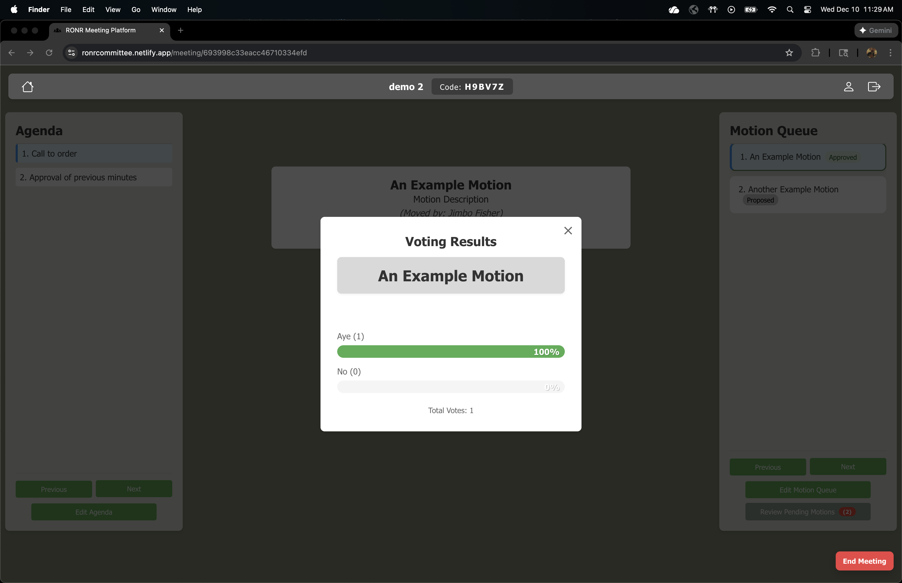

**Results Display:**
- Motion outcome (Approved/Failed/Tied/No Votes)
- Aye and No vote counts
- Dismiss button to continue meeting
- Results recorded for meeting minutes

##### End Meeting Confirmation

The chairman can end the meeting when all business is complete.

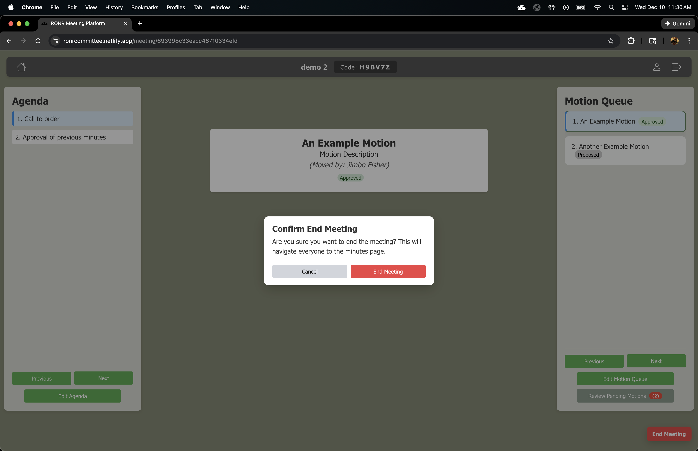

**End Meeting Features:**
- Confirmation dialog
- Ends the meeting for all participants
- Redirects everyone to the Minutes page

---

#### Member View

Participants have a streamlined interface focused on participation rather than control.

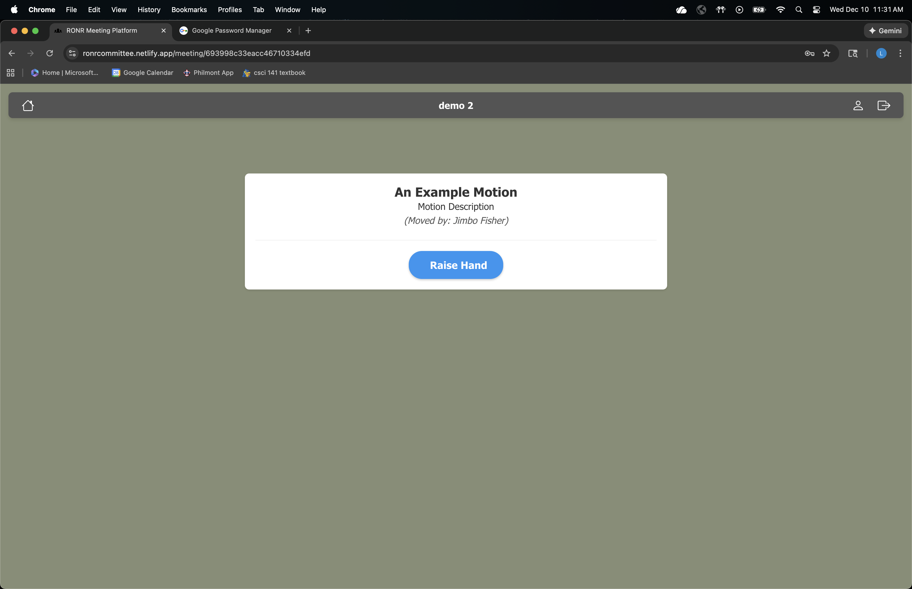

##### Current Motion Display

Members see the current motion being discussed.

**Display Features:**
- Motion title and description
- Motion creator attribution
- Clean, focused interface
- Updates in real-time as chairman navigates

##### Raising Hand / Proposing Motions

Members can propose new motions for the chairman to review.

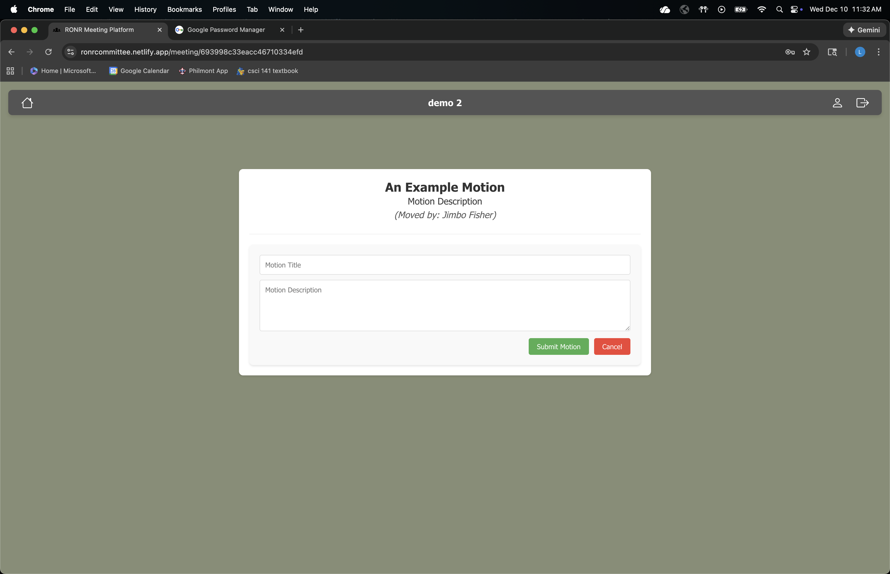

**Propose Motion Features:**
- "Raise Hand" button to open proposal form
- Motion title input
- Motion description input
- Submit and Cancel buttons
- Motions go to pending queue for chairman review

##### Voting as a Member

When the chairman starts a vote, members see voting buttons.

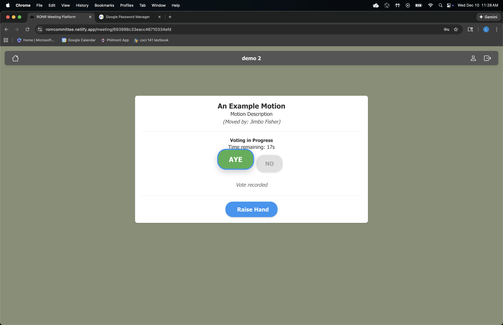

**Member Voting Features:**
- Clear Aye/No buttons
- 30-second countdown timer
- Vote confirmation message
- Selected vote highlighted
- Buttons disabled after voting

---

### 6. Meeting Minutes Page

After a meeting ends, all participants can view the recorded minutes.

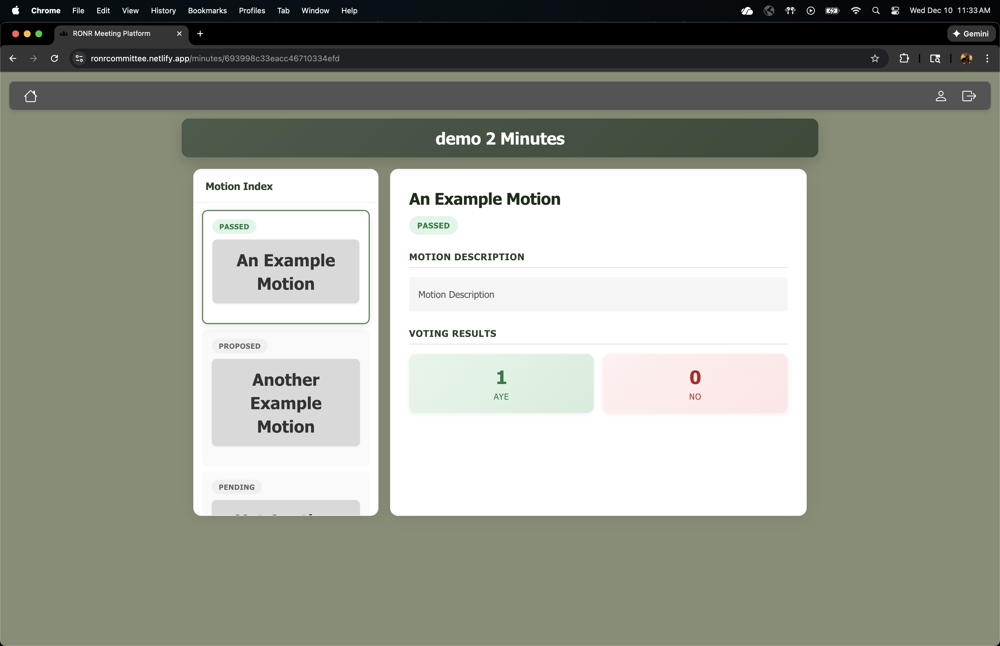

**Minutes Features:**
- Complete list of all motions
- Motion titles and descriptions
- Voting results for each motion
- Status indicators (Passed/Failed/Tied/Denied)
- Aye and No vote counts
- Expandable motion details
- Review history with timestamps

---

## API Documentation

For detailed information about all REST API endpoints, request/response formats, and authentication requirements, see:

📄 **[API_DOCUMENTATION.md](./API_DOCUMENTATION.md)**

---

## Database Structure

The application uses MongoDB with two main collections: **Users** and **Meetings**. Here's how the data is organized and how the entities relate to each other.

### Users Collection

Stores all registered user accounts.

| Field | Type | Description |
|-------|------|-------------|
| `_id` | ObjectId | Unique identifier (auto-generated) |
| `name` | String | User's display name |
| `email` | String | Unique email address for login |
| `password` | String | Hashed password |
| `role` | String | Account role: `member`, `chairman`, or `admin` |
| `description` | String | Optional bio/description |
| `phone` | String | Optional phone number |
| `profilePicture` | String | Base64-encoded profile image |

### Meetings Collection

Stores all meeting data, including nested motion queue.

| Field | Type | Description |
|-------|------|-------------|
| `_id` | ObjectId | Unique identifier (auto-generated) |
| `meetingId` | String | Meeting ID (same as `_id` by default) |
| `joinCode` | String | 6-character code for members to join (e.g., "ABC123") |
| `chairman` | ObjectId | **Reference to User** - the meeting creator/owner |
| `name` | String | Meeting title (max 30 characters) |
| `description` | String | Meeting description (max 200 characters) |
| `datetime` | String | Scheduled date and time |
| `ended` | Boolean | Whether the meeting has been ended by chairman |
| `currentAgendaIndex` | Number | Current position in the agenda |
| `currentMotionIndex` | Number | Current position in the motion queue |
| `agenda` | [String] | Array of agenda item names |
| `participants` | [ObjectId] | **Array of User references** - members who joined |
| `motionQueue` | [Motion] | **Array of Motion objects** (see below) |

### Motion Object (Embedded in Meeting)

Each motion in the `motionQueue` array contains:

| Field | Type | Description |
|-------|------|-------------|
| `_id` | ObjectId | Unique motion identifier |
| `name` | String | Motion title |
| `description` | String | Motion details |
| `creator` | String | Name of the person who proposed |
| `proposedBy` | String | User ID of the proposer |
| `status` | String | Current status (see lifecycle below) |
| `votes.aye` | Number | Count of "Aye" votes |
| `votes.no` | Number | Count of "No" votes |
| `voterIds` | [String] | Array of User IDs who have voted (prevents double-voting) |
| `votingEndsAt` | Date | Timestamp when voting period ends |

### Entity Relationships

```
┌─────────────────────────────────────────────────────────────┐
│                         MEETING                             │
├─────────────────────────────────────────────────────────────┤
│  chairman ──────────────────────────────► USER              │
│  participants[] ────────────────────────► [USER, USER, ...] │
│                                                             │
│  motionQueue[] ─┬─► MOTION 1                                │
│                 │     ├── name, description                 │
│                 │     ├── creator (proposer's name)         │
│                 │     ├── proposedBy ────► USER ID          │
│                 │     ├── status                            │
│                 │     ├── votes { aye, no }                 │
│                 │     └── voterIds[] ────► [USER IDs]       │
│                 │                                           │
│                 ├─► MOTION 2                                │
│                 │     └── ...                               │
│                 │                                           │
│                 └─► MOTION N                                │
│                       └── ...                               │
└─────────────────────────────────────────────────────────────┘
```

### Motion Status Lifecycle

Motions progress through these statuses:

```
pending ──► proposed ──► voting ──┬──► approved
   │                              ├──► failed
   │                              ├──► tied
   └──► denied                    └──► no-votes
```

1. **`pending`** - Newly proposed, awaiting chairman review
2. **`proposed`** - Approved by chairman, ready for voting
3. **`denied`** - Rejected by chairman (end state)
4. **`voting`** - Currently in 30-second voting period
5. **`approved`** - Passed (aye > no)
6. **`failed`** - Did not pass (no > aye)
7. **`tied`** - Equal votes
8. **`no-votes`** - No votes were cast

---

